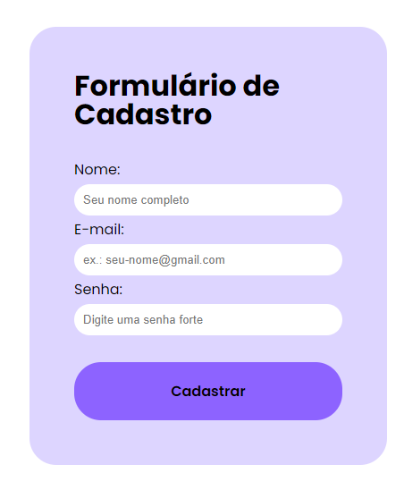

<h1>
Exercício Módulo 3
</h1>

<h2>
Resultado

 

</h2>

<h3>Orientações</h3>

A entrega desse exercício consiste em:

Criar um arquivo HTML que contenha um formulário de cadastro, com os campos nome, e-mail e senha e a existência de um botão para realizar o cadastro;

Adicionar também uma label para cada campo e referenciar essa label ao ID que será atribuído ao campo;

Enviar esse arquivo para o Github em uma branch chamada exercício_html;

Enviar o link para nossos tutores.

Atenção!

Exemplo da entrega:

